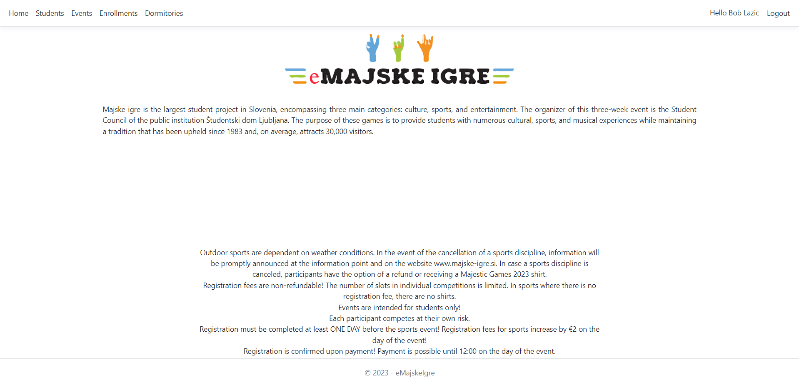
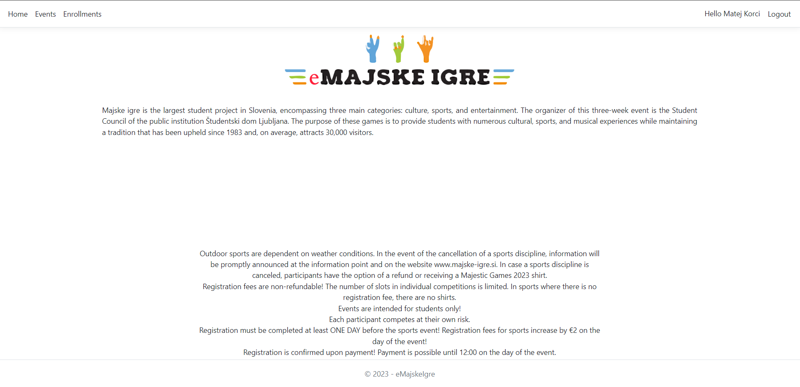
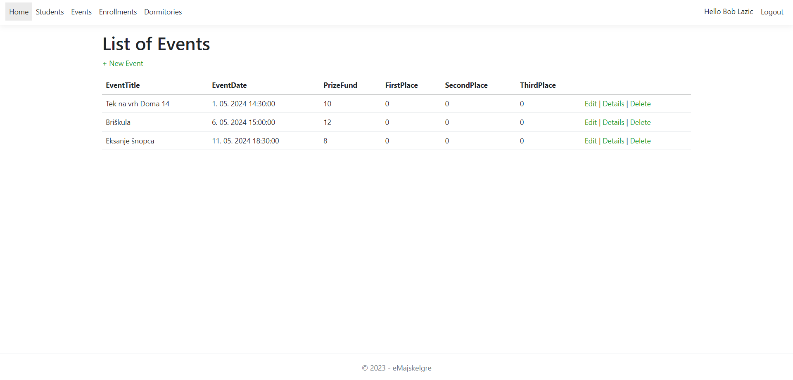
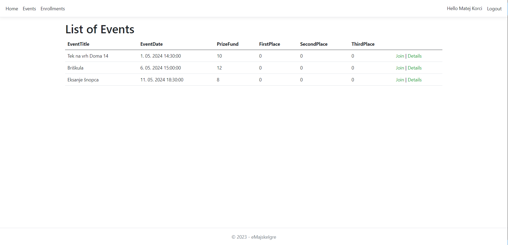
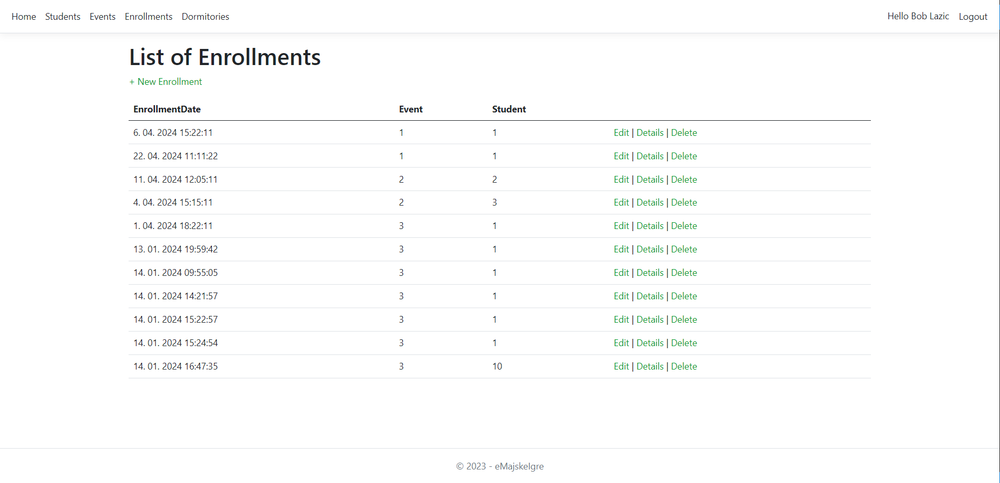
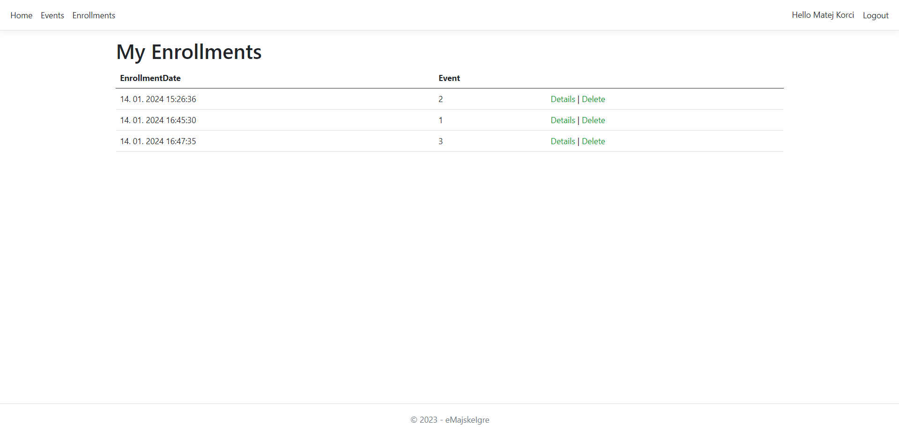
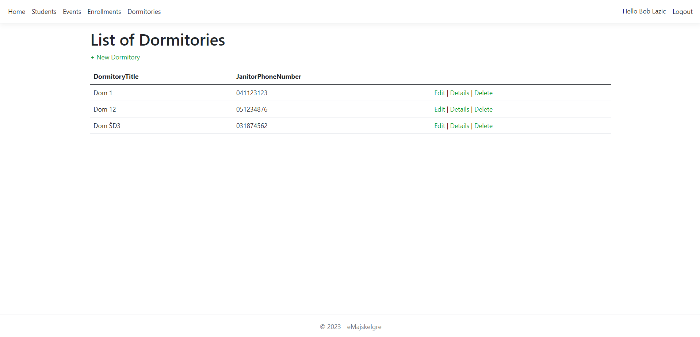
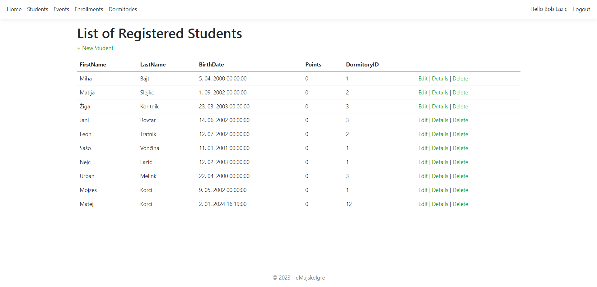

# Informacijski sistem *eMajskeIgre*
**Avtorja**: *Miha Lazić (63210183), Matija Bajt (63210017)*

**Opis domene**: Z informacijskim sistemom *eMajskeIgre* bomo podprli procese prijav na največjem študentskem dogodku Majskih igrah. V sklopu le-tega se vsako leto prirejajo tekmovanja, ki študentskim domovom prinašajo točke glede na uvrstitve njihovih študentov. Do sedaj so se študenti morali fizično prijaviti na tekmovanja, naš sistem bo pa to digitaliziral. Omogočal bo prijavo kot ‘študent’ ali ‘organizator’, pri čemer bo študentu na voljo pregled vseh razpisanih tekmovanj in prijavo oz. odjavo na le-te, organizator pa bo lahko dogodke dodajal, urejal, brisal in imel evidenco o številu prijavljenih študentov za posamezen študentski dom. S tem bomo študentu olajšali samo prijavo na tekmovanja, organizator pa bo imel informacijo, ali naj tekmovanje sploh izvede. Možnost za izboljšavo je hramba točk, ki jih za neko tekmovanje prinese neki študent za neki študentski dom (s tem imamo npr pregled nad najboljšimi tekmovalci).

**Opis aplikacije**: Informacijski sitem *eMajskeIgre* je aplikacija realizirana v **ASP.NET MVC** ogrodju in omogoča organizatorju *bob@example.com* dodajanje, brisanje in urejanje podatkov 4 sestavnih delov tekmovanja v podatkovno bazo **EntityFramework**. To so:
- *Študentski domovi* (Naziv, Hišnikov telefon)
- *Študenti* (Ime, Primek, Datum rojstva, Število točk, Študentski dom)
- *Prijave* (Čas prijave, Dogodek, Študent)
- *Dogodki* (Naziv, Opis, Čas začetka, Prvo mesto, Drugo mesto, Tretje mesto)
  
Navaden uporabnik (študent) se lahko registrira z podatki:
-  Ime
-  Priimek
-  Mesto
-  Študentski dom
-  Datum rojstva
-  Gmail
-  Geslo

Ob prijavi se mu odklenejo *Dogodki* in *Prijave*. V zavihku Dogodki si lahko študent ogleda nabor dogodkov, ki se bodo odvijali. Za več podrobnosti lahko klikne na dogodek ali pa gumb *Details*. Če mu je dogodek všeč se nanj prijavi z pritiskom na gumb *Join*. Tako se prijava na dogodek vpiše v podatkovno bazo (*Prijave*). Če si želi uporabnik ogledati svoje prijave si lahko to ogleda v zavihku *Prijave*. Tam dobi izpisane personalizirane prijave. V primeru, da si je premislil in se želi odjaviti od dogodka lahko pritisne na gumb *delete*.

**Dokumentacija API** : Aplikacija ima tudi dokumentacijo [**API**](https://emajskeigre.azurewebsites.net/swagger/index.html) za študente, dogodke in prijave. Da so podatki zaščiteni je potreben API Key = "SecretKey".

  
<em><b>Slika 1: Home View Organizator</b></em>

  
   

  
<em><b>Slika 2: Home View Studen</b></em>

  
   

  
<em><b>Slika 3: Events View Organizator</b></em>

  
   

  
<em><b>Slika 4: Events View Student</b></em>

  
   

  
<em><b>Slika 5</b>: Enrollments View Organizator</b></em>

  
   

  
<em><b>Slika 6: Enrollments View Student</b></em>

  
   

  
<em><b>Slika 7: Dormitory View Organizator</b></em>

  
   

  
<em><b>Slika 8: Students View Student</b></em>

  
   

