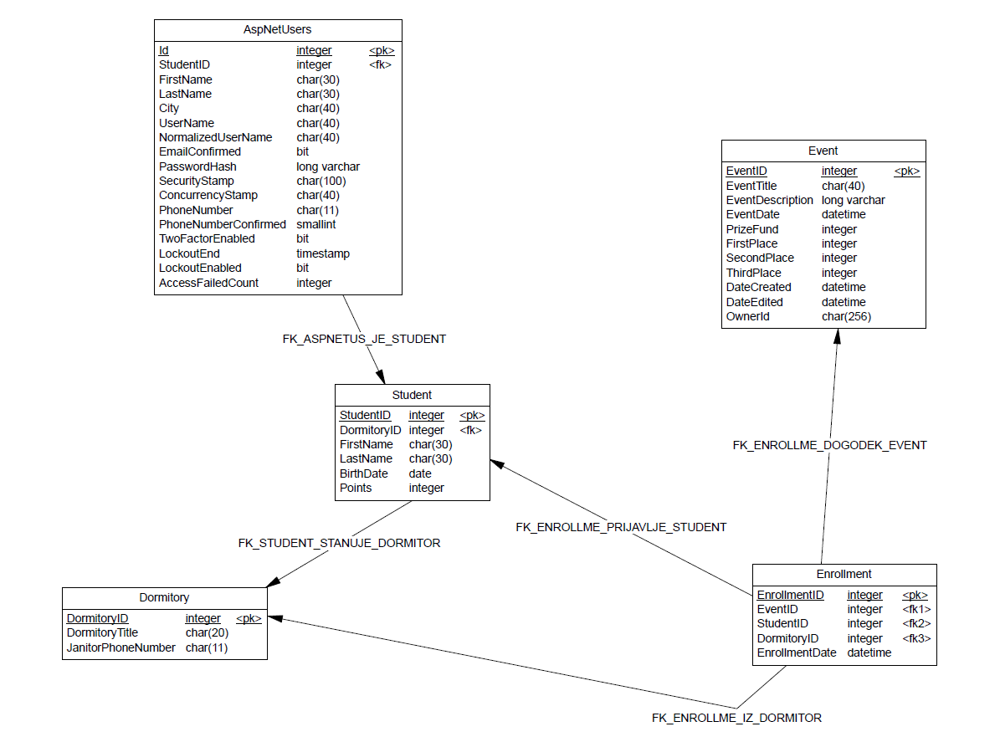
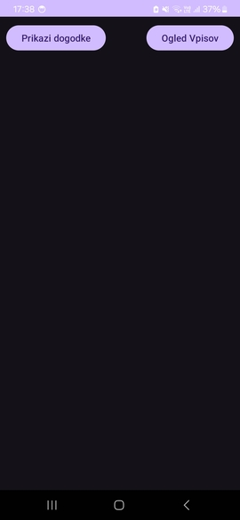
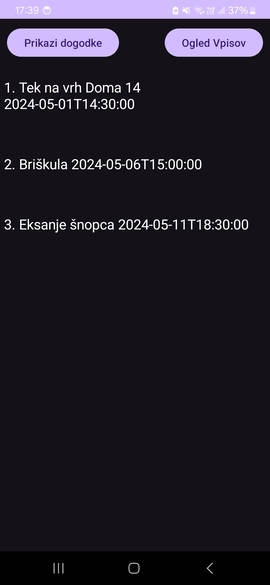
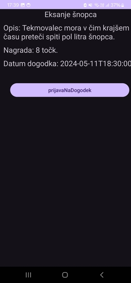

# Informacijski sistem *eMajskeIgre*
*Miha Lazić (63210183), Matija Bajt (63210017)*

## Opis domene
Z informacijskim sistemom *eMajskeIgre* bomo podprli procese prijav na največjem študentskem dogodku Majskih igrah. V sklopu le-tega se vsako leto prirejajo tekmovanja, ki študentskim domovom prinašajo točke glede na uvrstitve njihovih študentov. Do sedaj so se študenti morali fizično prijaviti na tekmovanja, naš sistem bo pa to digitaliziral. Omogočal bo prijavo kot ‘študent’ ali ‘organizator’, pri čemer bo študentu na voljo pregled vseh razpisanih tekmovanj in prijavo oz. odjavo na le-te, organizator pa bo lahko dogodke dodajal, urejal, brisal in imel evidenco o številu prijavljenih študentov za posamezen študentski dom. S tem bomo študentu olajšali samo prijavo na tekmovanja, organizator pa bo imel informacijo, ali naj tekmovanje sploh izvede. Možnost za izboljšavo je hramba točk, ki jih za neko tekmovanje prinese neki študent za neki študentski dom (s tem imamo npr pregled nad najboljšimi tekmovalci).

## Spletna aplikacija eMajskeIgre
<div>
  
  <b> Slika 1:</b> Home View Organizator
  <br />
  <br />
</div>
<div>
  
  <b> Slika 2:</b> Home View Student
  <br>
  <br />
</div>
<div>
  
  <b> Slika 3:</b> Events View Organizator
  <br>
  <br />
</div>
<div>
  
  <b> Slika 4</b>: Events View Student
  <br>
  <br />
</div>
<div>
  
  <b> Slika 5:</b> Enrollments View Organizator
  <br>
  <br />
</div>
<div>
  
  <b> Slika 6:</b> Enrollments View Student
  <br>
  <br />
</div>
<div>
  
  <b> Slika 7:</b> Dormitory View Organizator
  <br>
  <br />
</div>
<div>
  
  <b> Slika 8:</b> Students View Student
  <br>
  <br />
</div>

### Opis aplikacije

Informacijski sistem *eMajskeIgre* je aplikacija realizirana v **ASP.NET MVC** ogrodju in je namenjena predvsem 2 vrstam uporabnikov:

**Organizator Majskih iger** lahko dodaja, briše in ureja podatke 4 sestavnih delov tekmovanj
- *Študentski domovi* (Naziv, Hišnikov telefon)
- *Študenti* (Ime, Primek, Datum rojstva, Število točk, Študentski dom)
- *Prijave* (Čas prijave, Dogodek, Študent,Študentski dom)
- *Dogodki* (Naziv, Opis, Čas začetka, Zmagovalna nagrada, Prvo mesto, Drugo mesto, Tretje mesto, Čas ustvaritve, Čas urejanja, Lastnik)
  
**Študent** pa se lahko registrira in prijavi v sistem z namenom prijave na posamezen dogodek, s čimer bo lahko svojemu Študentskemu domu prinesel točke. Nudi mu tudi pregled nad vsemi oddanimi prijavami.

### Uporaba aplikacije
Študent (navaden uporabnik) se najprej registrira z naslednjimi podatki: *Ime, Priimek, Mesto, Študentski dom, Datum rojstva, Gmail, Geslo**. Ob vstopu v sistem se mu odkleneta zavihka *Dogodki* in *Prijave*. V zavihku *Dogodki* si lahko študent ogleda nabor dogodkov, ki se bodo odvijali. Za več podrobnosti lahko klikne na posamezen dogodek ali pa gumb *Details*. Na dogodek se lahko prijavi s pritiskom na gumb *Join*, s čimer se prijava na dogodek vpiše v relacijo *Prijave*. Če si uporabnik želi  pregledati svoje prijave, si lahko to ogleda v zavihku *Prijave*. V primeru, da si je premislil in se želi odjaviti od dogodka, lahko to stori s pritiskom na gumb *Delete*.

## Podatkovna baza
  
Podatkovno bazo smo najprej postavili lokalno v programu *Docker Desktop* kot kontejner **MS SQL Server**, ki smo jo z aplikacijo povezali preko preko povezovalnega niza ```EMIContext```. S knjižnico ```Microsoft.AspNetCOre.Identity``` smo v bazo dodali nove tabele potrebne za realizacijo avtentikacijo in avtorizacijo. V tabelo *AspNetRoles* smo dodali vloge uprabnikov: *Študent, Organizator, Administrator*. *Organizator* in *Administrator* imata pravice do vseh funkcij aplikacije, medtem ko *Študent* le do dogodkov in svojih prijav.  
Spodnja slika prikazuje logični model realizirane podatkovne baze brez tabel iz ```AspNetCore.Identity``` z izjemo tabele *AspNetUsers*, ki smo jo povezali s tabelo Students.
<div>
  
</div><br />

## Spletna storitev

Za dostop aplikacije na spletu smo aplikacijo s podatkovno bazo objavili v oblak *Microsoft Azure*. Tako je javno dostopna na temu [linku](https://emajskeigre.azurewebsites.net/) in podpira vse funkcionalnosti kot v lokalni verziji.  
Za potrebe mobilne aplikacije smo implementirali API za entitete *Študent*, *Dogodek* in *Prijave*. S pomočjo knjižnice ```Swashbuckle.AspNetCore``` smo generirali [**dokumentacijo**](https://emajskeigre.azurewebsites.net/swagger/index.html) vseh API controlerjev. Za varnost podatkov pa je poskrbljeno tako, da je potrebna avtorizacija z API ključem (API Key = "SecretKey").

## Odjemalec Android

### Opis mobilne aplikacije
Aplikacija predstavlja mobilno verzijo poenostavljene spletne aplikacije [eMajskeIgre](https://emajskeigre.azurewebsites.net/), ki smo jo realizirali v IDE okolju *Android Studio* s pomočjo API vmesnikov. Njena glavna funkcionalnost je prijava Študenta na posamezen dogodek na Majskih igrah.

### Uporaba mobilne aplikacije
Ko na zaslonu pritisnemo na gumb *Prikazi dogodke*, se nam prikažejo vsi objavljeni dogodki. S klikom nanj lahko pridobimo dodatne informacije o le-tem (potek, čas začetka in število točk). Prijava na dogodek je možna sklikom na gumb *prijavaNaDogodek*. Študent ima tudi možnost pregleda nad svojimi prijavami s klikom na gumb *Ogled Vpisov*.

### GUI mobilne aplikacije
<div>
  
  <p><b>Slika 1</b>: Home Screen</p>
  <br>
</div>

<div>
  
  <p><b>Slika 2</b>: Dogodki</p>
  <br>
</div>

<div>
  
  <p><b>Slika 3</b>: Podrobnosti dogodka</p>
  <br>
</div>

<div>
  
  <p><b>Slika 4</b>: Vse prijave uporabnika</p>
  <br>
</div>

## Razdelitev dela
```Miha Lazić``` je naredil naloge 1. seminarske naloge:
-  Izdelal načrt podatkovne baze
-  Postavil lokalno podatkovno bazo v Docker Desktop-u
-  Generiranje Controllerjev in priprava projekta na nadaljno razvijanje
-  Razširitev aplikacije z avtentikacijo  in avtorizacijo
-  Pripravil GitHub Repository
  
```Matija Bajt``` je naredil naloge 2. seminarske naloge:
-  Postavitev spletne aplikacije v oblaku, Azure
-  Generiranje API controllerjev za tabele Student, Event, Enrollment
-  Dokumentacija Swagger
-  Avtentikacija in avtorizacija vmesnika API z ApiKey="SecretKey"
-  Celotna Android aplikacija, ki vsebuje zahtevke GET, POST in DELETE


